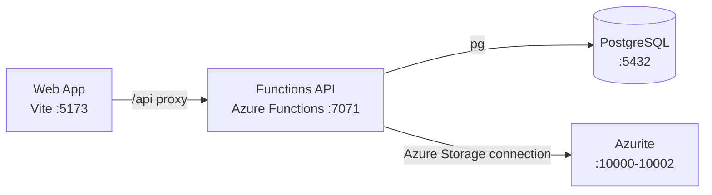

# Azure Debug Plan

> This plan is the source of truth for generating the
> VS Code debug setup in this workspace.
>
> **Status:** Executing
> **Execution Mode:** Guided
> **Created:** 2026-09-21T14:30:15Z
> **Last Updated:** 2026-09-21T14:48:00Z
>
> <!-- Guided Mode (default) - hand-holds the user through review and approval before generating. -->

## Prerequisites

| Tool / Extension | Category | Service(s) | Installed | Version |
|------------------|----------|------------|-----------|---------|
| Node.js | Runtime | * | ✅ | 24.11.1 |
| npm | Package manager | * | ✅ | 11.6.2 |
| Azure Functions Core Tools | Runtime | functions-api | ❓ | — |
| Azure CLI | Azure tooling | functions-api | ❓ | — |
| Docker Desktop | Container runtime | * | ✅ | 29.7.2 |
| Docker Compose | Container orchestration | * | ✅ | 5.5.0 |
| VS Code Azure Functions extension | Debug integration | functions-api | ❓ | — |
| VS Code | Editor/debugger | * | ❓ | — |

> ⚠️ **Action required:** Confirm any tool or extension marked ❓ is installed and ready before approving this plan. `func` and `az` were not found on the current PATH during the scan.

## Debug Configurations

| Generate | Debug Config Name | Service Label | Service Root | Project Type | Runtime | Version | Azure Dependencies |
|----------|--------------------|---------------|--------------|--------------|---------|---------|---------------------|
| [x] | Todonew Functions API (debug) | Functions API | ./services/functions | functions | node-ts | 24.x | Azure Storage, PostgreSQL |
| [x] | Todonew Web (debug) | Web App | ./services/web | frontend-spa | node-ts | 24.x | — |
| [x] | Debug All Services | Debug All Services | — | *Compound Config* | — | — | — |

ℹ️ Project Type Descriptions

| Project Type | Description |
|-------------|-------------|
| functions | Azure Functions serverless API with HTTP triggers and Node.js TypeScript execution |
| frontend-spa | React single-page application served by Vite |

> ℹ️ **Proxy detected:** Web App proxies `/api` to Functions API at `http://localhost:7071`. The compound configuration should start the API before the frontend.

## Orchestrator

| Orchestrator | Container Runtime | Compose Command | Description |
|-------------|-------------------|-----------------|-------------|
| Docker Compose | Docker | `docker compose` | Uses Docker Compose to run PostgreSQL and Azurite during local development. |

## Emulators

| Dependent Service | Emulator | Purpose |
|-------------------|----------|---------|
| Azure Storage | Azurite container | Provides the local Blob, Queue, and Table Storage endpoint required by the Functions host and attachment service. |
| PostgreSQL | PostgreSQL 16 Alpine container | Provides the local relational database for task data and migration execution. |

## Architecture Diagram

During debugging, the Vite web app calls the local Azure Functions API, which uses PostgreSQL for task data and Azurite for storage.

## Migrations

When selected, the generation phase creates automated VS Code tasks that run migration scripts on launch so the local database is provisioned before the API starts debugging.

| Generate | Service | Migration Tool |
|----------|---------|---------------|
| [x] | Functions API | Raw SQL via `npm --prefix services/functions run migrate` |

## API Test Collections

When selected, the generation phase produces lightweight, runnable API test scripts for local smoke testing.

| Generate | Service | Description |
|----------|---------|-------------|
| [x] | Functions API | 

HTTP Endpoints (5)
 GET /api/health GET /api/tasks POST /api/tasks PATCH /api/tasks/:id DELETE /api/tasks/:id  
 |

## Convenience Scripts

| Generate | Script | Registered In | Description |
|----------|--------|---------------|-------------|
| [x] | emulators:start | ./package.json | Start PostgreSQL and Azurite with the existing Compose file. |
| [x] | emulators:stop | ./package.json | Stop the local emulator containers without deleting data. |
| [x] | emulators:clean | ./package.json | Stop the emulator containers and remove their containers for a fresh local run. |
| [x] | db:migrate | ./package.json | Apply pending SQL migrations to the local PostgreSQL database. |