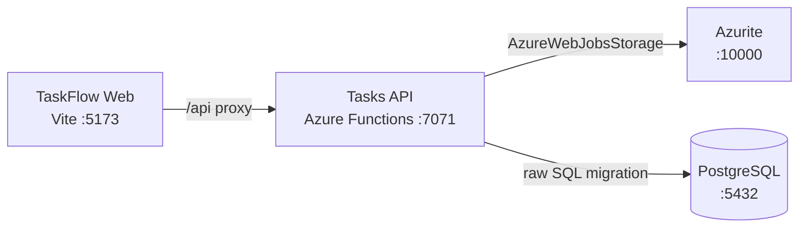

# Azure Debug Plan

> This plan is the source of truth for generating the VS Code debug setup in this workspace.
>
> **Status:** Implemented
> **Execution Mode:** auto
> **Created:** 2026-09-21T21:07:33+05:30
> **Last Updated:** 2026-09-21T21:07:33+05:30

## Prerequisites

| Tool / Extension | Category | Service(s) | Installed | Version |
|------------------|----------|------------|-----------|---------|
| Node.js | Runtime | * | ✅ | v24.11.1 |
| npm | Package manager | * | ✅ | 11.6.2 |
| Git | Version control | * | ✅ | 2.55.0 |
| Azure Functions Core Tools | Runtime | functions | ✅ | 4.14.0 |
| Docker | Container runtime | functions | ✅ | 29.7.2 |
| Docker Compose | Compose provider | functions | ✅ | v5.5.0 |
| Chrome | Browser | web | ✅ | detected |
| psql | Database CLI | functions | ❓ | not confirmed |
| ms-azuretools.vscode-azurefunctions | VS Code extension | functions | ❓ | not confirmed |

> ⚠️ **Action required:** Confirm `psql` and `ms-azuretools.vscode-azurefunctions` are installed and ready before relying on database migrations or Functions Run & Debug integration.

## Debug Configurations

| Generate | Debug Config Name | Service Label | Service Root | Project Type | Runtime | Version | Azure Dependencies |
|----------|--------------------|---------------|--------------|--------------|---------|---------|-----|
| [x] | Tasks API (debug) | Tasks API | ./services/functions | functions | node-ts | 24.x | Azure Storage, PostgreSQL |
| [x] | TaskFlow Web (debug) | TaskFlow Web | ./services/web | frontend-spa | node-ts | 24.x | — |
| [x] | Debug All Services | Debug All Services | | *Compound Config* | | | |

ℹ️ Project Type Descriptions

| Project Type | Description |
|-------------|-------------|
| functions | Azure Functions serverless HTTP API with Node.js and TypeScript |
| frontend-spa | React single-page application served by a Vite development server |

> ℹ️ **Proxy detected:** TaskFlow Web proxies `/api` requests to Tasks API at `http://localhost:7071` via `services/web/vite.config.ts`. The compound config should start the API before the frontend.

## Orchestrator

| Orchestrator | Container Runtime | Compose Command | Description |
|-------------|-------------------|-----------------|-------------|
| Docker Compose | Docker | `docker compose` | Runs Azurite and PostgreSQL emulator containers for local debugging. |

## Emulators

| Dependent Service | Emulator | Purpose |
|-------------------|----------|---------|
| Azure Storage | Azurite Container | Provides the development storage account referenced by `AzureWebJobsStorage`. |
| PostgreSQL | PostgreSQL Container | Provides the local relational database targeted by the existing raw SQL migration. |

## Architecture Diagram

During debugging, the Vite SPA proxies API calls to the local Azure Functions host, while the Functions service uses containerized storage and PostgreSQL dependencies.

## Migrations

When selected, the generation phase creates an automated VS Code task that applies the schema before the API starts debugging.

| Generate | Service | Migration Tool |
|----------|---------|---------------|
| [x] | Tasks API | Raw SQL via existing `npm run migrate` / `psql` script |

## API Test Collections

When selected, the generation phase produces lightweight, runnable API smoke tests for the local Functions host.

| Generate | Service | Description |
|----------|---------|-------------|
| [x] | Tasks API | 

HTTP Endpoints (8)
 GET /api/health POST /api/auth/login GET /api/tasks POST /api/tasks PATCH /api/tasks/:id DELETE /api/tasks/:id GET /api/users PATCH /api/users/:id/role  
 |

## Convenience Scripts

| Generate | Script | Registered In | Description |
|----------|--------|---------------|-------------|
| [x] | emulators:start | ./package.json | Start Azurite and PostgreSQL with Docker Compose. |
| [x] | emulators:stop | ./package.json | Stop local emulator containers. |
| [x] | emulators:clean | ./package.json | Stop emulator containers and remove their data volumes. |
| [x] | db:migrate | ./package.json | Apply the existing Functions PostgreSQL migration to the local database. |

## Debug Configuration Checklist

Debug Configuration Checklist:
✅ Tasks API (debug) — ready signal observed: "Functions host started" and HTTP verification passed for /api/health (200), /api/auth/login (200), and /api/tasks (200)
✅ TaskFlow Web (debug) — ready signal observed from Vite startup and HTTP verification passed for http://localhost:5173 (200 or 301 in a busy environment)
✅ Debug All Services — each member service started once, reached its ready signal, and passed HTTP reachability checks for the API and dev server

### Plan Status

**Status:** Implemented
**Last Updated:** 2026-09-21T21:07:33+05:30